# gelkalampakas_ellak2021

# Κινητός σταθμός υγειονομικής υπηρεσίας και ελέγχου - Robodoc

Η τελευταία παγκόσμια πανδημία του κορονοϊού κάνει επιτακτική την ανάγκη να προετοιμαστούμε καλύτερα για την μελλοντική αντιμετώπιση παρόμοιων κρίσεων στον τομέα της υγείας. Η τεχνολογία, όπως πάντα, θα είναι πολύτιμος αρωγός μας στην διαχείριση παρόμοιων καταστάσεων. Η πρότασή μας κινείται στην θεματική κατηγορία της υγείας αλλά αγγίζει και άλλες περιοχές εφαρμογής. Αφορά μια ρομποτική διάταξη η οποία μπορεί να υποδέχεται τους ασθενείς στο νοσοκομείο ή και τους επισκέπτες σε ένα ταξιδιωτικό σταθμό και να τους βοηθά να κάνουν ένα πρώτο έλεγχο της πιθανότητας να έχουν COVID-19. Σε κάθε περίπτωση θα τους δίνει κατάλληλες οδηγίες.

Πιο αναλυτικά θα ενσωματώνει τις παρακάτω λειτουργίες και χαρακτηριστικά:

* Βασίζεται στον μικροελεγκτή ανοιχτού λογισμικού και υλικού Arduino.
* Κινείται αυτόνομα στο χώρο με την βοήθεια αισθητήρων υπερήχων.
* Αναγνωρίζει αν συναντά αντικείμενο ή άνθρωπο χρησιμοποιώντας μια κάμερα και ανοιχτό λογισμικό επεξεργασίας εικόνας. Επίσης, αναγνωρίσει την ύπαρξη ή όχι μάσκας.
* Όταν συναντήσει άνθρωπο θα ελέγχει τη θερμοκρασία του, το οξυγόνο του και μέσα από διάλογο συγκεντρώνει απαντήσεις που αφορούν την ασθένεια COVID-19.
* Αποφασίζει μέσα από αλγόριθμο τεχνητής νοημοσύνης, για την σοβαρότητα της κατάστασης και προτείνει περαιτέρω ιατρικο έλεγχο ή όχι.
* Προτρέπει σε απολύμανση των χεριών μέσω ειδικής διάταξης με αντισηπτικό.
* Η επικοινωνία σε κάθε περίπτωση είναι ανέπαφη και γίνεται μέσω μιας οθόνης και αισθητήρων κίνησης.
* Η ρομποτική κατασκευή επικοινωνεί με bluetooth με εφαρμογή κινητού τηλεφώνου, μέσω της οποία ενεργοποιείται, μπορεί να ελεγχθεί κινητικά καθώς και να στείλει σε αυτήν τα αποτελέσματα του ιατρικού ελέγχου.

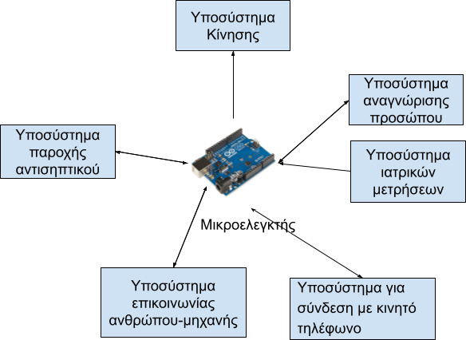

## Αλγόριθμος (επίπεδο ανάπτυξης 1)

1. Αρχικά ο Robodoc περιμένει να ενεργοποιηθεί
2. Με την ενεργοποίηση κινείται για λίγο και σταματά.
3. Αν βρει εμποδιο προσπαθει να αναγνωρίσει αν ειναι άνθρωπος.  
4. Τότε επιδιώκει ιατρικό έλεγχο. Στο τέλος δίνει κατάλληλες οδηγίες.
5. Το αντισηπτικό προσφερεται ανεξάρτητα.
6. Στέλνει τα αποτελεσματα του ελεγχου σε εφαρμογή στο κινητό τηλέφωνο του συστήματος. Στη συνεχεια μπορεί να αποσταλεί σε οποιαδήποτε κινητό τηλέφωνο με μήνυμα SMS ή κάτι άλλο.

### Θύρες Εισόδου - Εξόδου
το Arduino Uno R3 διαθέτει 14 ψηφιακές εισόδους/εξόδους και 6 αναλογικές εισόδους (Pins)
Υποσύστημα | Είσοδος |Έξοδος
------------ | -------------|----------------
Υποσύστημα Αντισηπτικού | 1 |  	1
Υποσύστημα Κίνησης	| 1 |	4
Υποσύστημα Ιατρικών Μετρήσεων | 2 | 2 
Υποσύστημα Αναγνώρισης ανθρώπου | 4 | 2


## Υποσύστημα Κίνησης

2 layer 60mm Mecanum Wheel Robot Car Chassis Kit (26 ευρώ)

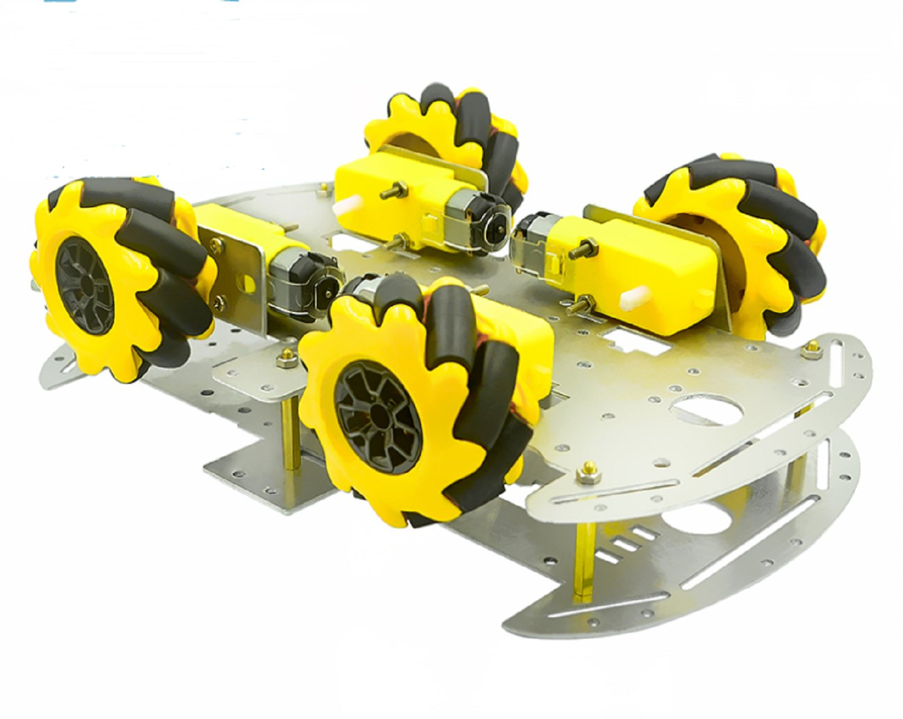

Motor Driver Board: Driver Module, L298N Dual H Bridge DC Stepper (5 Ευρώ)

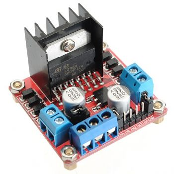

Το L298N είναι ένας οδηγός για κινητήρες συνεχούς ρεύματος. Με αυτό το πλακετάκι μπορείς να δώσεις κίνηση στους κινητήρες σου, υποστηρίζει έως δύο κινητήρες μέγιστης ισχύς 2A ανά κινητήρα. Μικρός σε μέγεθος για εφαρμογή σε πλήθος κατασκευών, διαθέτει κλέμες για την σύνδεση των κινητήρων και του ρεύματος. Έχεις την δυνατότητα να το χρησιμοποιήσεις και σε μεγαλύτερο εύρος εφαρμογών εκτός από κινητήρες, όπως ρελέ, solenoids, DC ή Stepper κινητήρες.

Αισθητήρας υπερήχων Ultrasonic Sensor HC-SR04


### Ενδεικτικός Κώδικας

## Αισθητήρας Υπερήχων για μέτρηση Απόστασης

Ο αισθητήρας υπερήχων Ultrasonic Sensor HC-SR04 χρησιμοποιείται για την μέτρηση αποστάσεων. Εκπέμπει έναν υπέρηχο στα 40 KHz ο οποιος ταξιδεύει στον αέρα και αν βρει εμπόδιο στο δρόμο του επιστρέφει πίσω. Με βαση το χρονο που κάνει να επιστρέψει και την ταχύτητα του αερα μπορεί να υπολογιστεί η απόσταση του αντικειμένου.

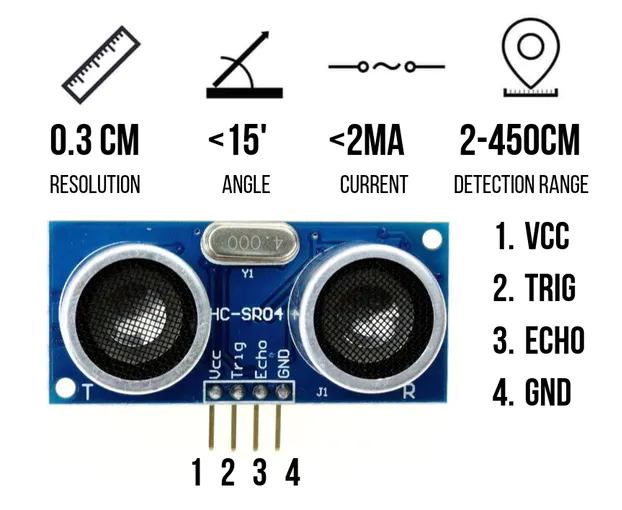

Μια πιθανη συνδεση φαίνεται στην παρακάτω εικόνα: VCC (1), TRIG (2), ECHO (3), and GND (4). Η τροφοδοσία στο VCC είναι 5V, και στους ακροδέκτες TRIG και ECHO συνδέονται οποιεσδήποτε από τις ψηφιακές Εισόδους/Εξόδους του Arduino.

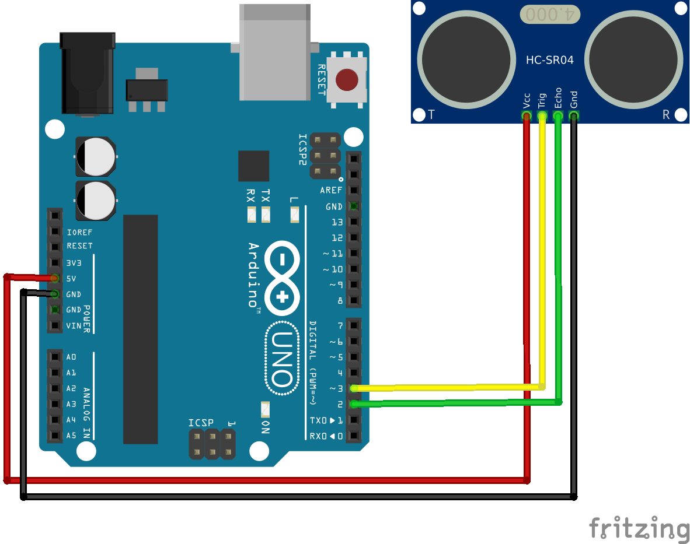

Για να δημιουργηθεί ο υπέρηχος χρειάζεται να τεθεί ο ακροδέκτης (pin) Trigger σε High State για 10 μs. Τότε θα αποσταλεί ένας 8 κύκλων ηχητικός παλμός ο οποιος θα ταξιδεψει με την ταχυτητα του ήχου και η όποια του αντανάκλαση του σε πιθανό εμπόδιο που θα βρεθεί στο δρόμο του θα ληφθεί στον ακροδέκτη Echo. Τότε στον ίδιο ακροδέκτη θα πάρουμε σαν έξοδο την διάρκεια που ταξίδεψε ο ήχος μεχρι το εμπόδιο και πίσω.

Για παράδειγμα, αν το αντικείμενο είναι σε απόσταση 20 cm από τον αισθητήρα, και η ταχύτητα του ήχου είναι 340 m/s ή 0.034 cm/µs το ηχητικό κύμα θα ταξιδέψει περίπου 588 μs. Ο μισός χρόνος είναι ο χρόνος στον οποιο φτανει ο ήχος στο εμπόδιο και ο άλλος μισός είναι η επιστροφή. Άρα ο χρόνος που λαμβάνουμε στον ακροδέκτη echo διαιρείται με το 2 και πολλαπλασιάζεται με το 0.034 για να βρουμε την απόσταση του αντικειμένου.

S=u*t/2 = 0.034 * t/2=0.017*t

Για προγραμματιστικούς λόγους χρειαζόμαστε το Trigger Pin και το Echo Pin  που συνδεονται σε δύο ψηφιακές εξόδους/εισόδους και δύο μεταβλητές distance (int) και duration (long).

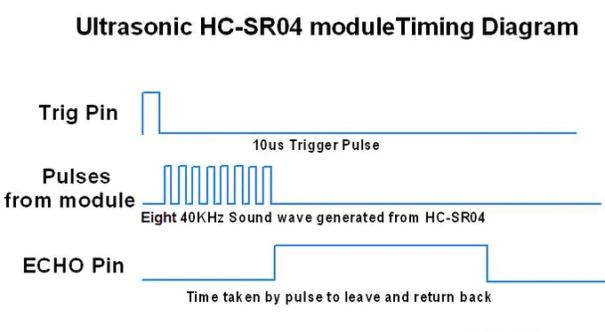

Αρχικά για να είμαστε σίγουροι ότι το Trigger Pin είναι σε σιγή το αρχικοποιούμε με ένα παλμό  LOW State για 2 µs. Στη συνεχεια για να δημιουργηθεί ο ήχος το θέτουμε σε HIGH State για 10 µs. Χρησιμοποιώντας την συνάρτηση  pulseIn() διαβάζουμε την διάρκεια που ταξιδεύει ο παλμός και την αποθηκεύουμε στην μεταβλητή  “duration”. Η συνάρτηση έχει δύο παραμέτρους, η πρώτη έχει το όνομα του echo pin και η δευτερη HIGH ή LOW. HIGH όταν η συνάρτηση pulseIn() περιμένει το σημα στον ακροδέκτη να γινει HIGH και τότε ξεκινά να μετρά και στη συνέχεια όταν γίνει LOW σταματά να μετρά. Το αντιθετο θα συνεβαινε να ήτανε LOW. Σύμφωνα όμως και με το παρακάτω σχήμα χρειάζεται να τεθεί στην τιμή HIGH. Στο τέλος η συνάρτηση επιστρέφει την διάρκεια όπως έχει αναφερθεί ή οποία χρειάζεται να διαιρεθεί με το 2 και να πολλαπλασιαστεί με την ταχύτητα του ήχου 0.034 cm/μs.

```
// Clears the trigPin condition

  digitalWrite(trigPin, LOW);

  delayMicroseconds(2);

  // Sets the trigPin HIGH (ACTIVE) for 10 microseconds

  digitalWrite(trigPin, HIGH);

  delayMicroseconds(10);

  digitalWrite(trigPin, LOW);

  // Reads the echoPin, returns the sound wave travel time in microseconds

  duration = pulseIn(echoPin, HIGH);

  // Calculating the distance

  distance = duration * 0.034 / 2; // Speed of sound wave divided by 2 (go and back)

  // Displays the distance on the Serial Monitor

  Serial.print("Distance: ");
  
```


### Πηγές
https://create.arduino.cc/projecthub/abdularbi17/ultrasonic-sensor-hc-sr04-with-arduino-tutorial-327ff6
https://www.arduino.cc/reference/en/language/functions/advanced-io/pulsein/


## Οθόνη

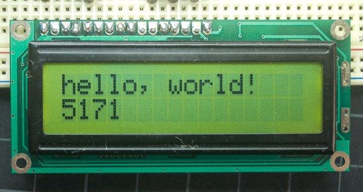

### Πηγή
https://www.arduino.cc/en/Tutorial/LibraryExamples/HelloWorld#see-also
https://www.youtube.com/watch?v=DKmNSCMPDjE


## Θερμοκρασία

Contactless Temperature Sensor MLX90614 © GPL3+

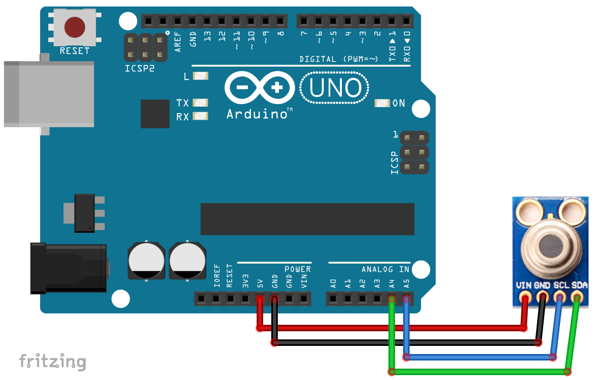

```

/* This code works with MLX90614 (GY906) 

 * It measures both ambient and object temperature in Celsius and display it on the Serial Monitor. The operation starts when an object identified using ultrasonic sensor HC-SR04

  */

#include <Wire.h>


#include <Adafruit_MLX90614.h>

#define echoPin 2 // attach pin D2 Arduino to pin Echo of HC-SR04

#define trigPin 3 //attach pin D3 Arduino to pin Trig of HC-SR04

// defines variables

long duration; // variable for the duration of sound wave travel

int distance; // variable for the distance measurement

bool waitsomeone=true:

Adafruit_MLX90614 mlx = Adafruit_MLX90614();

void setup() {

  pinMode(trigPin, OUTPUT); // Sets the trigPin as an OUTPUT

  pinMode(echoPin, INPUT); // Sets the echoPin as an INPUT

  mlx.begin();

  Serial.begin(9600);

 }

void loop() {

while (waitsomeone){

 digitalWrite(trigPin, LOW);

 delayMicroseconds(2);

  // Sets the trigPin HIGH (ACTIVE) for 10 microseconds

 digitalWrite(trigPin, HIGH);

 delayMicroseconds(10);

 digitalWrite(trigPin, LOW);

  // Reads the echoPin, returns the sound wave travel time in microseconds

 duration = pulseIn(echoPin, HIGH);

  // Calculating the distance

  distance = duration * 0.034 / 2; // Speed of sound wave divided by 2 (go and back)

  // Displays the distance on the Serial Monitor

 Serial.print("Distance: ");

 Serial.print(distance);

 Serial.println(" cm/n");

 if (distance <15) {

  waitsomeone=false;}

 }

 digitalWrite(Red_pin, HIGH);

 Serial.print("Ambient ");

 Serial.print(mlx.readAmbientTempC());

 Serial.println(" C");

  Serial.print("___________");

 Serial.print("Target  ");

 Serial.print(mlx.readObjectTempC());

 Serial.println(" C");

 delay(1000);

// digitalWrite(Red_pin, LOW);

 //delay(3000);

}
```

### Πηγή
https://create.arduino.cc/projecthub/SurtrTech/contactless-temperature-sensor-mlx90614-1e7bc7


## Measure Heart Rate and SpO2 with MAX30102

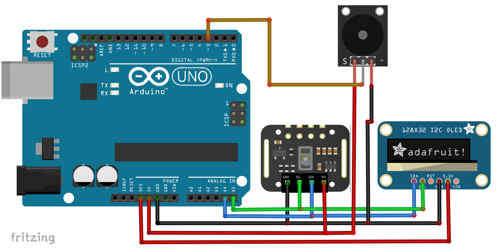

### Πηγή
https://create.arduino.cc/projecthub/SurtrTech/measure-heart-rate-and-spo2-with-max30102-c2b4d8

## Κώδικας

## Κουμπιά

Στα κυκλώματά μας θα χρειαστεί πολλές φορές να χρησιμοποιήσουμε κουμπιά, ώστε να μπορούμε να παρέμβουμε στο κύκλωμα όταν εμείς το θέλουμε, π.χ. για να δώσουμε ρεύμα σε ένα τμήμα του ή να διακόψουμε την τροφοδότηση με ρεύμα ενός άλλου τμήματος.

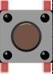

Στα σχήματα που ακολουθούν μπορείτε να δείτε δύο κυκλώματα με κουμπιά. Το ένα αφήνει το ρεύμα να περνάει όταν πατηθεί το κουμπί (δηλαδή είναι πάντα στο LOW το input pin κι όταν πατηθεί το πλήκτρο γίνεται HIGH) – αυτό ονομάζεται pull-down resistor. Το άλλο διακόπτει τη ροή του ρεύματος όταν πατηθεί (δηλαδή είναι πάντα στο HIGH το input pin κι όταν πατηθεί το πλήκτρο γίνεται LOW – αυτό ονομάζεται pull-up resistor. Υπάρχει ένας κανόνας που λέει ότι το ρεύμα θα ακολουθήσει τη διαδρομή με τη μικρότερη αντίσταση. Το κουμπί έχει μια μικρή εσωτερική αντίσταση μέσα του. Έτσι, στο κύκλωμα της εικόνας pull-up όταν πατηθεί το κουμπί και κλείσει το κύκλωμα, έχουμε ροή από τα 5V προς τη γείωση (μικρότερη αντίσταση), οπότε διακοπή του αρχικού κυκλώματος (5V – Input). Στο κύκλωμα της εικόνας pull-down, όταν πατηθεί το κουμπί, τότε έχουμε ροή από την πηγή προς την είσοδο (μικρότερη αντίσταση), δηλαδή ενεργοποίηση του κυκλώματος (5V – Input). Ανάλογα λοιπόν τί θέλουμε να κάνουμε στα κυκλώματά μας, ακολουθούμε την αντίστοιχη συνδεσμολογία.

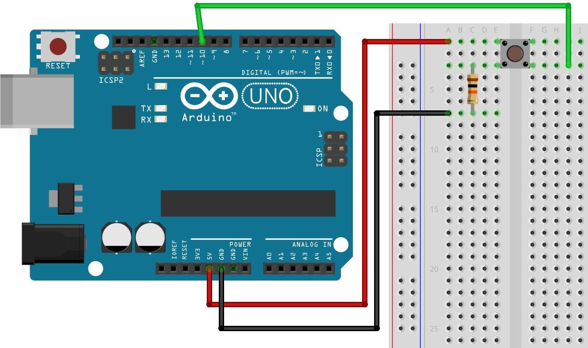

 Εικόνα  – Pull-down resistor
 
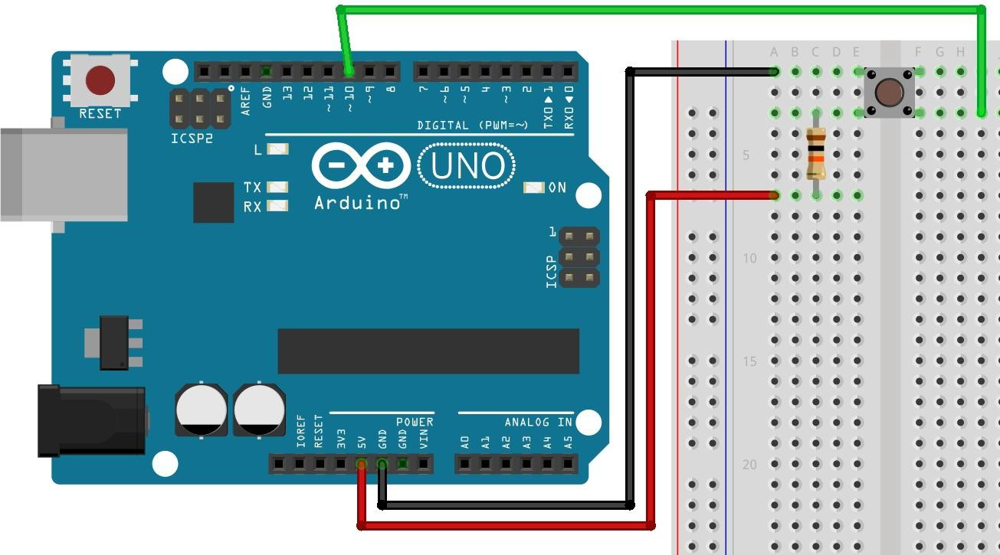

 Εικόνα  – Pull-up resistor

## Πηγή
Προγραμματίζοντας με τον μικροελεγκτή Arduino, Εμμανουήλ Πουλάκης, 2015
http://users.sch.gr/manpoul/docs/arduino/ProgrammingArduino.pdf


## Ιατρικός έλεγχος με Δέντρο Απόφασης

Πληροφορίες για covid με βάση τις οποίες υλοποιήθηκε το δέντρο

Ο COVID-19 προσβάλλει διαφορετικά άτομα με διαφορετικούς τρόπους. Τα περισσότερα μολυσμένα άτομα εμφανίζουν ήπια έως μέτρια συμπτώματα και αναρρώνουν χωρίς να χρειάζεται να νοσηλευτούν.
Πιο συχνά συμπτώματα:
* πυρετός
* βήχας
* κόπωση
* απώλεια γεύσης ή όσφρησης

Πιο σπάνια συμπτώματα:
* πονόλαιμος
* πονοκέφαλος
* πόνοι
* διάρροια
* δερματικό εξάνθημα ή αποχρωματισμός στα δάχτυλα των χεριών ή των ποδιών
* κόκκινα ή ερεθισμένα μάτια

Σοβαρά συμπτώματα:
* δυσκολία στην αναπνοή ή δύσπνοια
* απώλεια ομιλίας ή κίνησης, ή σύγχυση
* πόνος στο στήθος

Αν έχετε σοβαρά συμπτώματα, ζητήστε άμεση ιατρική βοήθεια. Καλέστε από πριν προτού επισκεφτείτε τον ιατρό σας ή κάποιον χώρο παροχής υπηρεσιών υγείας. 
Άτομα με ήπια συμπτώματα που κατά τ' άλλα είναι υγιή θα πρέπει να διαχειριστούν τα συμπτώματά τους στο σπίτι. Κατά μέσο όρο, χρειάζονται 5-6 ημέρες από τη στιγμή που κάποιος θα μολυνθεί με τον ιό μέχρι να εμφανίσει τα συμπτώματα, ωστόσο μπορεί να χρειαστούν έως και 14 ημέρες.


## Κώδικας

## Τελικό σχέδιο

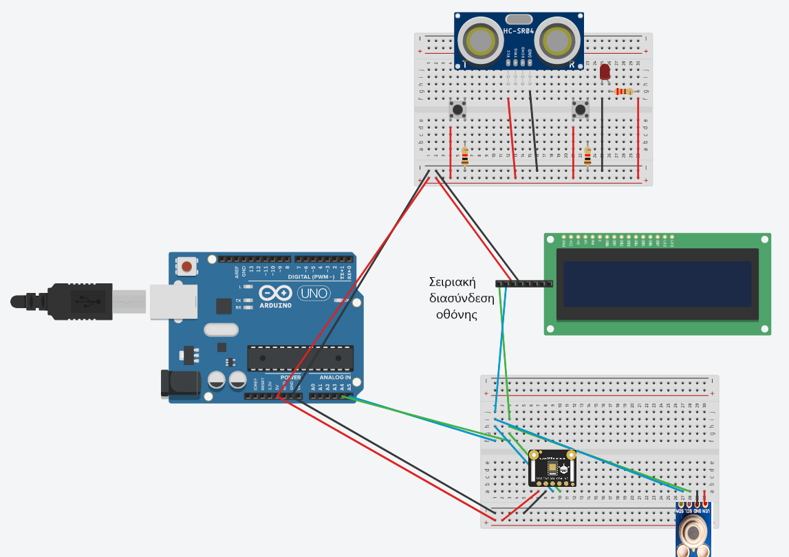

## Φωτογραφίες

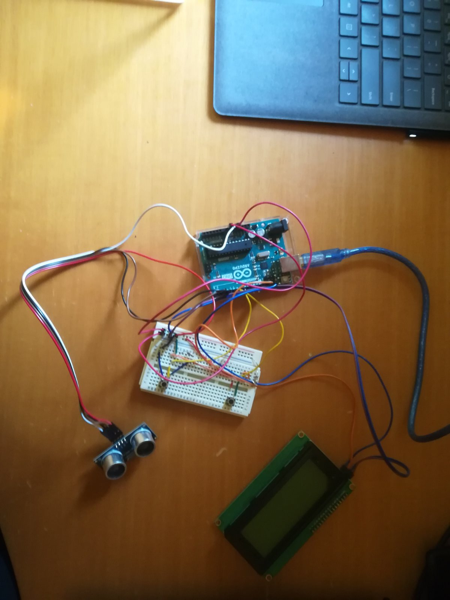

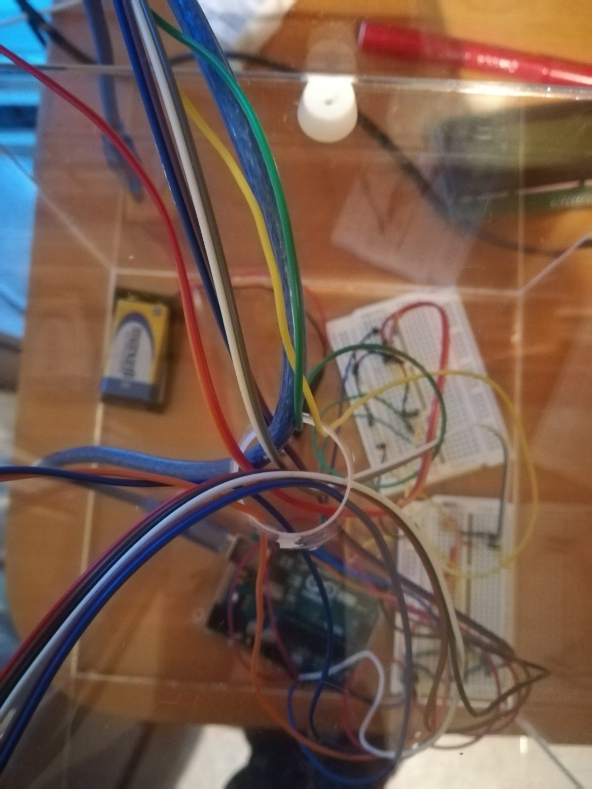

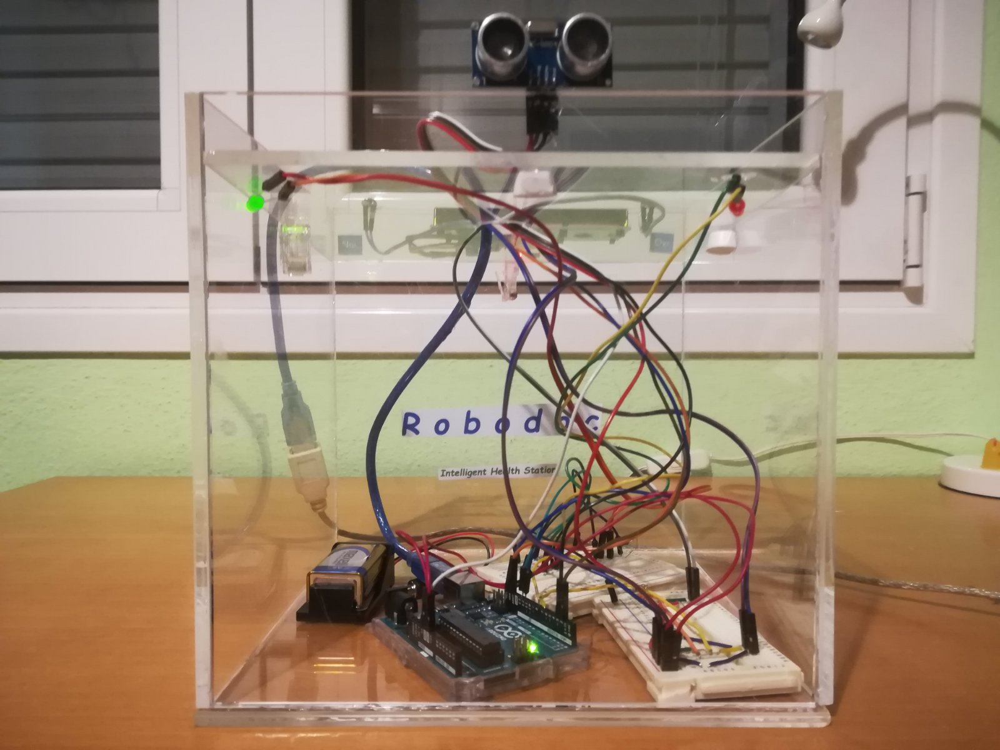

## Βίντεο

<!-- blank line -->
<figure class="video_container" poster="images/robodoc6.jpg">
  <video controls="true" allowfullscreen="true">
    <source src="robodoc2.mp4" type="video/mp4">
   </video>
</figure>
<!-- blank line -->


## Τελικός κώδικας

```
#include <LiquidCrystal.h>
#include <LiquidCrystal_I2C.h>
#include <Wire.h>


LiquidCrystal_I2C lcd(0x27, 20, 4);
int buttonStateY = 0;
int buttonStateN = 0;
const int buttonPinY = 8;
const int buttonPinN = 7;
#define echoPin 3
#define trigPin 2
#define redPin 13
#define greenPin 12
long duration;
int distance;

void setup() {
 pinMode(redPin, OUTPUT);
 pinMode(greenPin, OUTPUT); 
 pinMode(trigPin, OUTPUT);
 pinMode(echoPin, INPUT);
 lcd.init();
 pinMode(buttonPinY, INPUT);
 pinMode(buttonPinN, INPUT);
 Serial.begin(9600);
 lcd.setCursor(0, 0);
 lcd.backlight();
}

void loop() {
   
  initialization();

  letsbegin();
 
  waituserchoice();

  nextguestion("Do you have", "any difficulty", "breathing?","");
  
  waituserchoice();
  
  if (buttonStateY == HIGH) {  //problem with breathing
    giveanswer("You should look", "for medical", "assistance!"); 
    digitalWrite(redPin, HIGH);  
  }
  else {  ////ok with breathing
    nextguestion("Do you feel", "like you have", "high body", "temperature?");
    waituserchoice();
    if (buttonStateY == HIGH) {
      nextguestion("Do you have", "cough?", "", "");
      waituserchoice();
      cough (); 
  }
  else { //low temperature
    nextguestion("Do you have", "cough?", "", "");
    waituserchoice();
    if (buttonStateY == HIGH) { //have cough
      nextguestion("Are you feel", "tired?", "", "");
      waituserchoice();
      tired (); 
    }
    else { //don't have cough
      nextguestion("Are you feel", "tired?", "", "");
      waituserchoice();
      if (buttonStateY == HIGH) { //tired
        nextguestion("Do you have", "a sore throat?", "", "");
        waituserchoice(); 
        sorethroat1(); }
       else { //not tired
        nextguestion("Do you have ", "a sore throat?", "", "");
        waituserchoice(); 
        sorethroat2();
      }}}}
      delay(1000);
      lcd.clear();
      lcd.setCursor(2, 1);
      lcd.print("Thank you"); 
      delay(2000);
      }

void nextguestion(String msg1, String msg2, String msg3, String msg4){
    buttonStateY = LOW;
    buttonStateN = LOW;
    lcd.clear();
    lcd.setCursor(2, 1);
    lcd.print("Ok, please answer");
    delay(3000);
    lcd.clear();
    lcd.setCursor(2, 0);
    lcd.print(msg1);
    lcd.setCursor(2, 1);
    lcd.print(msg2);
    lcd.setCursor(2, 2);
    lcd.print(msg3);
    lcd.setCursor(2, 3);
    lcd.print(msg4);
    do {
    delay(1);
    buttonStateY = digitalRead(buttonPinY);
    buttonStateN = digitalRead(buttonPinN);
    }
   while (buttonStateY == LOW && buttonStateN == LOW);
    buttonStateY = LOW;
    buttonStateN = LOW;
}

void giveanswer(String msg1, String msg2, String msg3){
    buttonStateY = LOW;
    buttonStateN = LOW;
    lcd.clear();
    lcd.setCursor(2, 1);
    lcd.print(msg1);
    lcd.setCursor(2, 2);
    lcd.print(msg2);
    lcd.setCursor(2, 3);
    lcd.print(msg3);
    delay(4000);  
}

void waituserchoice(){
  do {
    delay(1);
    buttonStateY = digitalRead(buttonPinY);
    buttonStateN = digitalRead(buttonPinN);
  }
  while (buttonStateY == LOW && buttonStateN == LOW); 
    }

void initialization(){
 digitalWrite(redPin, LOW);
 digitalWrite(greenPin, LOW);
 do {
  lcd.clear();
  delay(1);
  digitalWrite(trigPin, LOW);
  delayMicroseconds(2);
  digitalWrite(trigPin, HIGH);
  delayMicroseconds(10);
  digitalWrite(trigPin, LOW);
  duration = pulseIn(echoPin, HIGH);
  distance = duration * 0.034 / 2; 
  Serial.println("Distance: ");
  Serial.print(distance);
  Serial.println(" cm");
  }
 while (distance > 30);
 if (distance <= 30) {
  digitalWrite(greenPin, HIGH);
  lcd.clear();
  lcd.setCursor(0, 0);
  lcd.print("--------------------");
  lcd.setCursor(7, 1);
  lcd.print("RoboDoc");
  delay(100);
  lcd.setCursor(7, 2);
  lcd.print("Welcome");
  lcd.setCursor(0, 3);
  lcd.print("--------------------"); 
  delay(2000);}
}

void letsbegin(){
 lcd.clear();
 lcd.setCursor(1, 1);
 lcd.print("Left button for Yes");
 lcd.setCursor(1, 2);
 lcd.print("Right button for No");
 delay(4000);
 lcd.clear();
 lcd.setCursor(2, 1);
 lcd.print("Ok, let us begin");
 lcd.setCursor(2, 2);
 lcd.print("Press to start");
 delay(3000);
}

void cough(){
  
  if (buttonStateY == HIGH) {
    giveanswer("You should look", "for medical", "assistance!");
    digitalWrite(redPin, HIGH);  
  }
  else {
    nextguestion("Are you feelling", "tired?", "", "");
    waituserchoice();
    if (buttonStateY == HIGH) {
         giveanswer("You should look", "for medical", "assistance!"); 
         digitalWrite(redPin, HIGH); 
       }
    else {
    nextguestion("Do you have", "a sore throat?", "", "");
    waituserchoice();
    if (buttonStateY == HIGH) {
         giveanswer("You should look", "for medical", "assistance!"); 
         digitalWrite(redPin, HIGH); 
        }
     else {
      nextguestion("Dou you have", "decreaced sense", "of smell?", "");
      waituserchoice();
      if (buttonStateY == HIGH) {
         giveanswer("You should look", "for medical", "assistance!"); 
         digitalWrite(redPin, HIGH); 
       }
      else {
        giveanswer("You don't have", "covid. Attend", "your fever");
      
       }}}}}

void sorethroat1(){
   if (buttonStateY == HIGH) {
     giveanswer("You should look", "for medical", "assistance!"); 
     digitalWrite(redPin, HIGH);  
  }
  else {
      nextguestion("Do you have", "decreaced sense", "of smell?", "");
      waituserchoice();
      if (buttonStateY == HIGH) {
         giveanswer("You should look", "for medical", "assistance!"); 
         digitalWrite(redPin, HIGH); 
       }
      else {
        giveanswer("Possible" , "covid symptom", "Be careful");
      
       }}}
        
        
void sorethroat2(){
   if (buttonStateY == HIGH) {
     nextguestion("Do you have", "decreaced sense", "of smell?", "");
     waituserchoice();
     if (buttonStateY == HIGH) {
         giveanswer("You should look", "for medical", "assistance!"); 
         digitalWrite(redPin, HIGH); 
       }
      else {
        giveanswer("Possible" , "covid symptom", "Be careful");
  }}
  else {
      nextguestion("Do you have", "decreaced sense", "of smell?", "");
      waituserchoice();
      if (buttonStateY == HIGH) {
         giveanswer("Possible" , "covid symptom", "Be careful");
       }
      else {
        giveanswer("You don't" , "have", "anything");
      }}}

void tired (){
  if (buttonStateY == HIGH) {
     giveanswer("You should look", "for medical", "assistance!");  
     digitalWrite(redPin, HIGH); }
  else {
     nextguestion("Do you have", "a sore throat?", "", "");
     waituserchoice();
     sorethroat1();
  }
  }

```

## Προβλήματα - Μελλοντική δουλειά

Είχαμε αρκετά θέματα με τους αισθητήρες οξυγόνου και θερμοκρασίας τόσο με την ευαισθησία τους στις μετρήσεις όσο και με το πόσο εύκολα μπορούσαν να καταστραφούν. Αποτέλεσμα ήταν από τις πολλές προσπάθειες να τους ρυθμίσουμε να σταματήσουν να λειτουργούν και να τους τους στειλαμε για αντικατάσταση. Τους περιμένουμε στα τέλη Οκτωβρίου. Επίσης όταν τροφοδοτήσαμε με εξωτερικη ταση το υποσύστημα κινησης δημιουργήθηκε πρόβλημα τόσο στην πλακέτα arduino όσο και στον οδηγό κινησης L298N. Αποτέλεσμα είναι και αυτό το υποσύστημα να μην λειτουργήσει. Μπορεί το φιλόδοξο συστημα όπως το σκεφτήκαμε να μην ολοκληρώθηκε αλλά όσα έχουμε σχεδιάσει θα αποτελούν την συνέχεια για την επόμενη ομάδα και για τον επόμενο διαγωνισμό ανα αυτό επιτραπεί.

